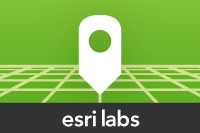

# AuGeo - Augmented Reality for ArcGIS

AuGeo, latin for augmented, is an [Esri Labs](http://labs.esri.com) initiative to explore the possibilities of using ArcGIS data in an augmented reality environment. 

We at Esri Labs see many potential uses for Augmented Reality in GIS. While we love maps, locating assets around you can be easier through the lenses of a camera on your phone or tablet. Through an augmented reality view, we can more intuitively represent hidden assets (underground, covered by vegetation or snow), reducing the time needed for people to find what they were looking for. Will Augmented Reality help perform asset inspections more quickly?  Will it guide rescue teams towards a fire hydrant that otherwise would be missed?  Will if provide the ultimate mobile user experience for the most technology averse real estate agent? Will it be the foundation for the next tourist guide of your city?

As a Research Project from Esri Labs, our intent with Augeo is to make interesting technology available to you, so we can explore the possibilities together. To start with AuGeo, all you need is an ArcGIS Online subscription, some data and a mobile device. We would love to hear your feedback through our Github Repository and evolve what already looks like a gold (Au) mine of possibilities. 

## How to use the app

Available for free in the [iTunes](http://links.esri.com/esrilabs/augeo/ios), [Google Play](http://links.esri.com/esrilabs/augeo/android) and [Microsoft](http://links.esri.com/esrilabs/augeo/windowsstore) stores, you can also download desktop installation files for the app from these urls

http://links.esri.com/esrilabs/augeo/windows

http://links.esri.com/esrilabs/augeo/mac 

http://links.esri.com/esrilabs/augeo/ubuntu

The AuGeo mobile app allows you to easily bring data from your exiting ArcGIS point feature layers into an augmented reality mobile app.  Preparing your existing data for use within AuGeo is very straight-forward as described in this <a href="http://links.esri.com/esrilabs/augeo/tutorial">tutorial</a>.

For more information on how to use AuGeo refer to the [Github Wiki](https://github.com/ArcGIS/AuGeo/wiki).

## Developer requirements

Are you a developer? AuGeo is built using <a href="http://www.esri.com/landing-pages/appstudio">AppStudio for ArcGIS</a>. The source code of this application will be made available here once AppStudio 2.0 is released in July 2017 and will also be available with the Standard Edition of AppStudio for ArcGIS.

## Issues

Find a bug or want to request a new feature?  Please let us know by submitting an issue into this repo.

## Contributing

Esri welcomes contributions from anyone and everyone. Please see our [guidelines for contributing](https://github.com/esri/contributing).

## Copyright and License

Copyright © 2017 Esri Inc.

Licensed under the Apache License, Version 2.0 (the "License");
you may not use this file except in compliance with the License.
You may obtain a copy of the License at

> http://www.apache.org/licenses/LICENSE-2.0

Unless required by applicable law or agreed to in writing, software
distributed under the License is distributed on an "AS IS" BASIS,
WITHOUT WARRANTIES OR CONDITIONS OF ANY KIND, either express or implied.
See the License for the specific language governing permissions and
limitations under the License.

A copy of the license is available in the repository's [LICENSE](./LICENSE) file.
